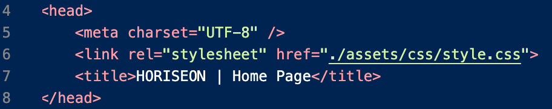
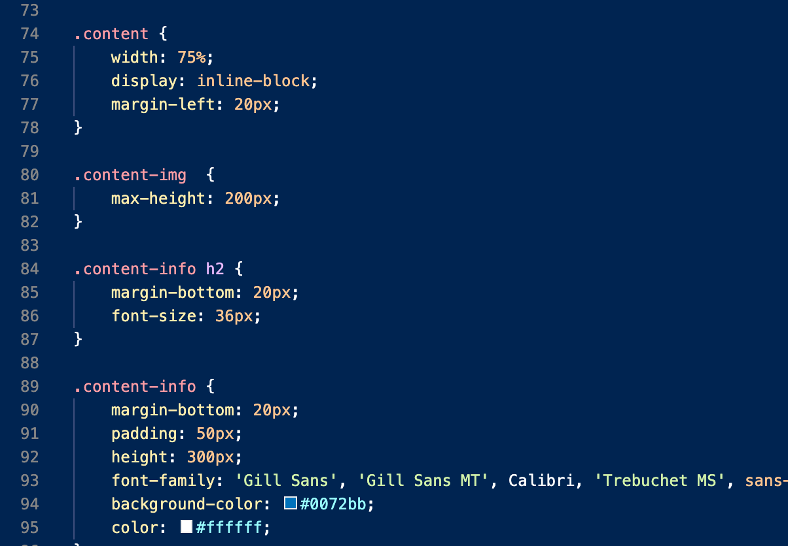
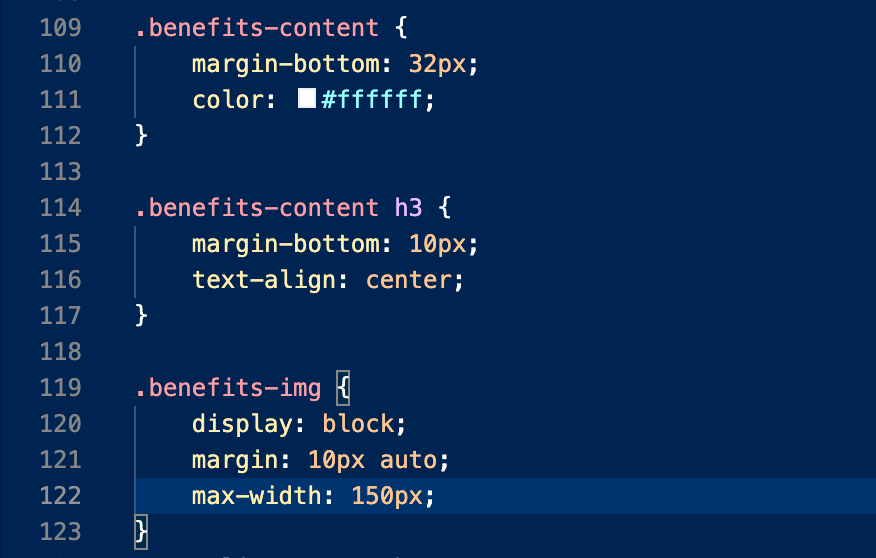

## HTML Changes :

* Change the tital of the wedsite : 

* Added comments.

* Change the div tags to header, footer, nav, section, aside : 

* Added new class name : 

* Fixed the nav links :

* Added alt on the image 

## CSS Changes : 

* Added comments.

* Reordered the selector so it macth the strucer of the HTML.

* Deleted the redundant codes 

